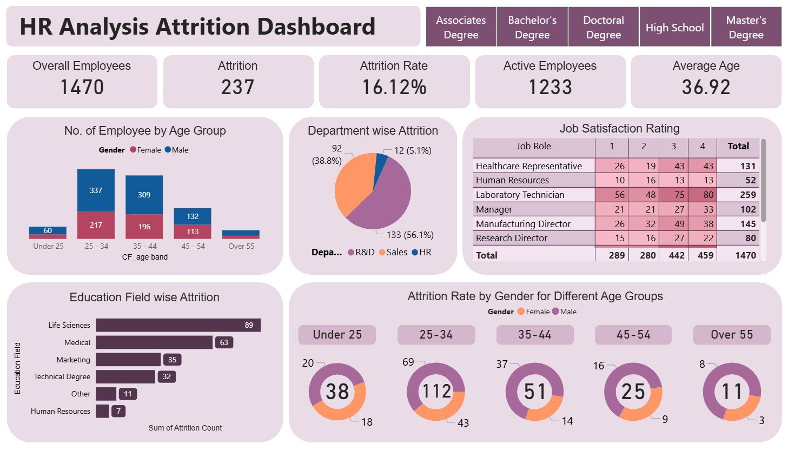

# 🖥️ HR Analysis Attrition Dashboard

## 📚 About Data
Description.
Description.

#hranalysisattrition

## 💡 Highlights

- a
- b
- c
- d
- e

## ✏️ Data Wrangling
Conducted simple data wrangling and data cleaning:

- Removed rows with missing values
- Cleaned Valuation and Funding columns and cast as float
- Exclude rows with "Unknown" Funding values
- Explode Select Investors column into individual rows for categorical analysis

📍 Jupyter script: Notebook

📍 Clean Data: a.csv

## 📊 Visualization
- Produced a 1-pager dashboard using Power BI.
- Power BI : [Link](https://app.powerbi.com/view?r=eyJrIjoiZWJhODc1MGMtMjQzMS00Njc2LWE3MzQtYzI4ZWJlOTk4OWViIiwidCI6ImFjZWQ1ODNlLTRhM2ItNDJkZS05ZTQ0LTRlNWFmYTk5Yjk4YSIsImMiOjEwfQ%3D%3D)

