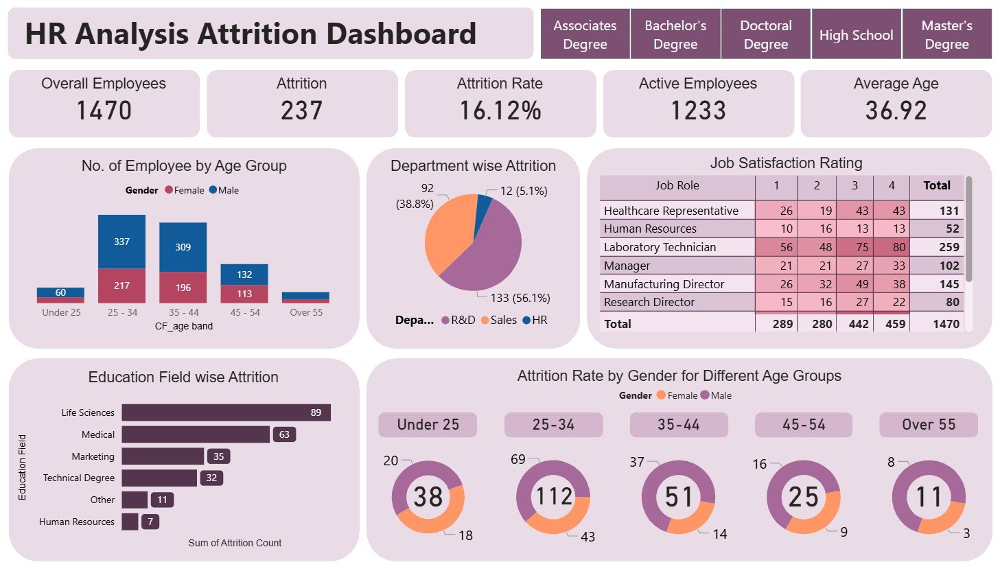

# 🖥️ HR Analysis Attrition Dashboard

An interactive Power BI dashboard analyzing employee attrition across various departments, education fields, age groups, job roles and satisfaction levels. Built to help HR professionals identify workforce trends, retention challenges and areas needing intervention.

---

## 📚 About Data

The dataset includes detailed HR records of 1,470 employees, capturing demographic, job, and education-related features. Key data points include:
- Department, Job Role, and Education Field
- Gender and Age Group
- Job Satisfaction Levels
- Attrition Status (Yes/No)

---

## 💡 Highlights

- Overall Attrition Rate is 16.12%, with 237 employees leaving out of 1,470 total.
- The R&D department accounts for the highest attrition (56.1%), followed by Sales (38.8%).
- The 35–44 age group has the highest number of employees (505), while 25–34 age group shows the highest attrition (112 employees).
- Life Sciences and Medical fields experience the most attrition by education field, with 89 and 63 employees respectively.
- Laboratory Technicians report the highest attrition by job role and show a wide range in job satisfaction levels, with 80 employees rating 3.

---

## ✏️ Data Wrangling

- Removed rows with missing values
- Cleaned and converted numeric columns to appropriate formats
- Filtered out entries with "Unknown" or null values
- Performed categorical expansion for deeper demographic analysis

---

## 🔍 Purpose

This dashboard is designed for HR managers, analysts and business leaders to:
- Identify departments and roles with high attrition
- Understand patterns across demographics (age, gender, education)
- Take action on job satisfaction trends and employee retention risks

---

## 🧠 Data Storytelling
Attrition appears most concentrated within critical talent pools. For instance, while the 35–44 age group makes up the bulk of the workforce, the 25–34 group is leaving at a faster rate. Departments like R&D are particularly vulnerable, contributing over half of all attrition cases, signaling potential engagement or workload challenges. Additionally, high attrition from Life Sciences and Medical backgrounds may affect knowledge retention in specialized roles. Notably, Laboratory Technicians show a wide spread in job satisfaction scores, suggesting varying employee experiences within the same role.

This analysis can guide HR in developing targeted retention strategies, improving satisfaction, and addressing high-risk departments.

---

## 📌 Tools Used

Power BI for data visualization and dashboard creation. [Link](https://app.powerbi.com/view?r=eyJrIjoiZWJhODc1MGMtMjQzMS00Njc2LWE3MzQtYzI4ZWJlOTk4OWViIiwidCI6ImFjZWQ1ODNlLTRhM2ItNDJkZS05ZTQ0LTRlNWFmYTk5Yjk4YSIsImMiOjEwfQ%3D%3D)

